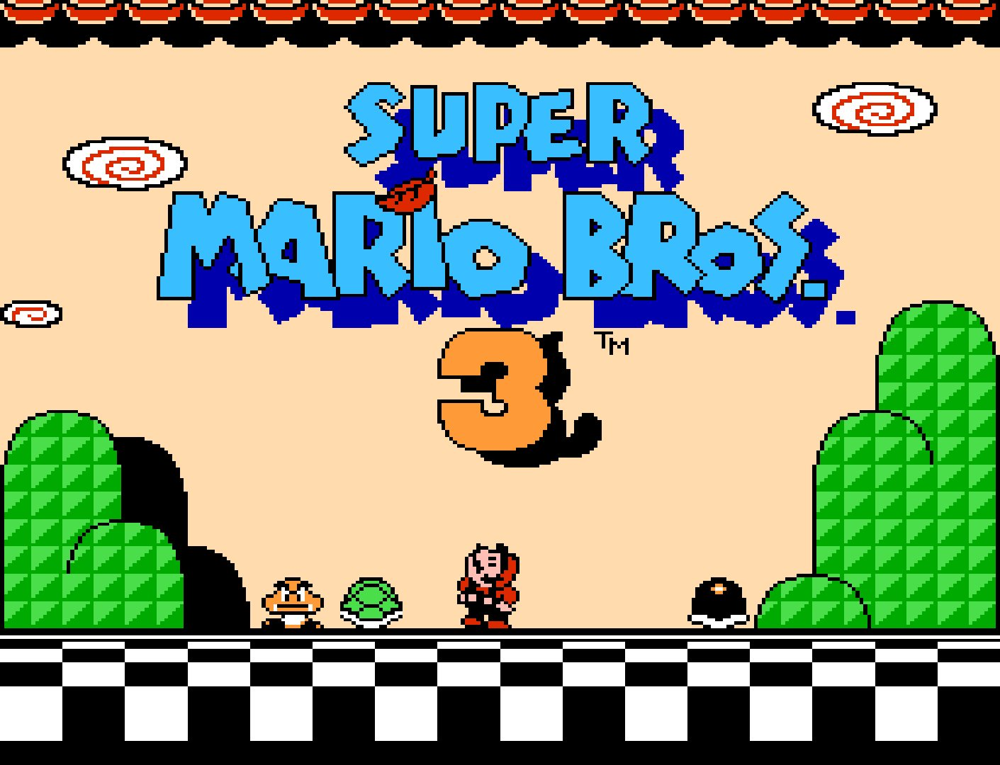
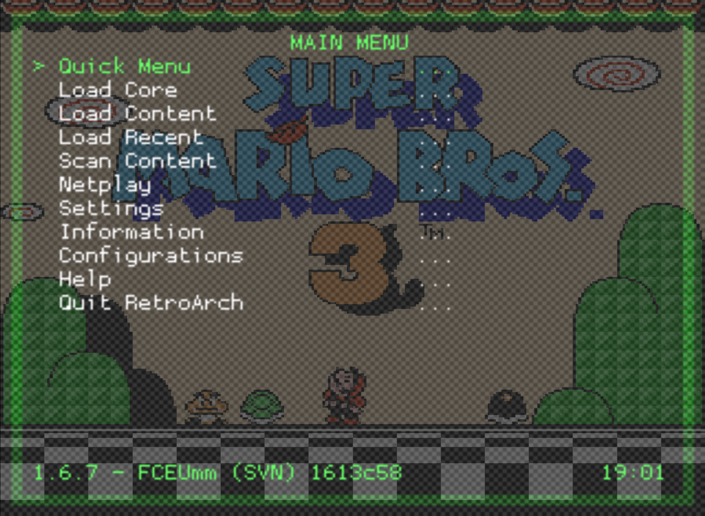
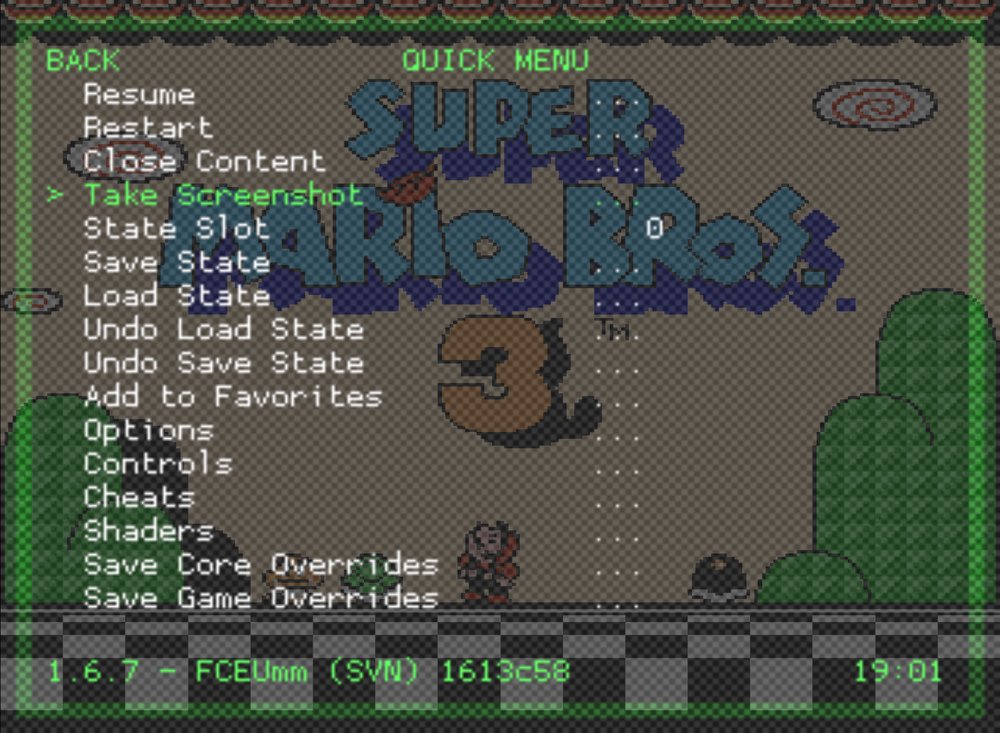
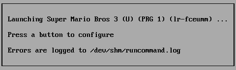
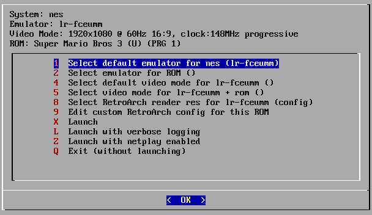
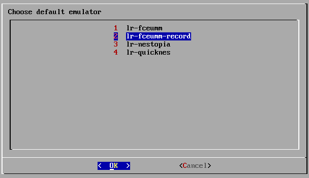
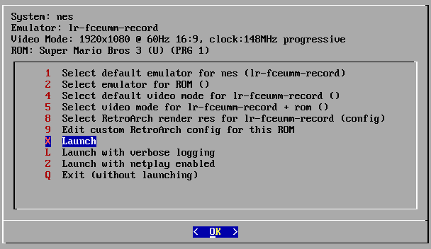

## Retrorecord [](https://travis-ci.org/rickycodes/retrorecord)

share screenshots and recrordings from RetroPie to twitter:  
https://twitter.com/whatmeplaying



## Requirements
This was setup to run on a Raspberry Pi 3 Model B running [RetroPie](https://retropie.org.uk/). I'm sure it would work on other [Retroarch](https://www.retroarch.com/)'s as well. I wouldn't try this on an older Pi 1, or single core system. The screenshot stuff should work (maybe this should be configurable?) but the recording/gif converting would likely be too slow on a single core system (it can already bog down the Pi 3 at times).

Requirements:

| software    | command   | version  |
|-------------|-----------|----------|
| cargo       | `cargo`   | >=0.22.0 |
| gifski      | `gifski`  | =0.8.2   |
| ffmpeg      | `ffmpeg`  | =3.1.4   |

(I am sure versions can flex a bit)

If you are setting these things up on RetroPie you can follow these guides:

- [Recording Live Gameplay in RetroPie’s RetroArch Emulators Natively on the Raspberry Pi](https://retroresolution.com/2016/07/06/recording-live-gameplay-in-retropies-retroarch-emulators-natively-on-the-raspberry-pi/#li_before_proceeding)
- [Recording gameplay videos on RetroPie](https://www.artificialworlds.net/blog/2018/01/07/recording-gameplay-videos-on-retropie/) ([with some handy shell scripts!](https://github.com/andybalaam/retropie-recording))
- [I also ran into this snag](https://github.com/libretro/RetroArch/issues/5717#issuecomment-357494398)

## Installation
clone this repo somewhere:  
`git clone git@github.com:rickycodes/retrorecord.git`

## Configuration
The application requires the following environment variables to be `export`ed on your system eg:

```sh
export TWITTER_CONSUMER_KEY= \
TWITTER_CONSUMER_SECRET= \
TWITTER_ACCESS_TOKEN= \
TWITTER_ACCESS_TOKEN_SECRET= \
SCREENSHOTS_DIR=/home/pi/.config/retroarch/screenshots/ \
RECORDINGS_DIR=/home/pi/recordings/ \
GIFS_DIR=/home/pi/gifs/
```
The directories should match what you have set in Retropie's own config.

If you don't have the above env vars set the application will quit on startup:
```
application started...
prompts are OFF
Couldn't read SCREENSHOTS_DIR (environment variable not found)
```

## Build
build with cargo:  
`cargo build`  
or:  
`cargo build --release`

## Tests
run unit tests:  
`cargo test --verbose`

## Startup
run the binary:  
`./retrorecord`  
or:  
`./retrorecord --prompt`  
(this will prompt you before posting)

## Usage:
run the binary:  
`./retrorecord`  
and you should see:  
```sh
application started...
prompts are OFF
```

### Screenshot:
|  |
|-|
| Get to a screen in game that you'd like to capture and enter the main menu of RetroArch: |
|  |
| Go into the "Quick Menu" and select "Take Screenshot": |

retrorecord will print something like this to stdout:  
```sh
file written: "/home/pi/.config/retroarch/screenshots/Super Mario Bros 3 (U) (PRG 1)-180425-190211.png"
posted tweet!
```

### Recording

|  |
|-|
|Launch a game that has an emulator with an option where you've enabled recording: <br />(Press a button to configure):|
|       |
| Select default emulator, or Select emulator for ROM: |
|   |
| Select the emulator where you've enabled recording: |
|  |
| Now simply launching the game will start recording: |

Once you exit the game the recording will stop and you should seem some ffmpeg output from retrorecord followed by:  
```sh
gif complete!
gif_path is "/home/pi/gifs/output.gif"
posted tweet!
```
If you want to record specific sections of a game consider using save states: play the game with the normal emulator to a point where you'd like to start recording, save state then relaunch with the recording enabled and load state to record from that point onward.

## Notes
All this app really does is watch folders for screenshots & recordings, so presumably you could get this to work on most systems? While this was used to create [whatmeplaying](https://twitter.com/whatmeplaying) you could use a similar setup to post screenshots/videos/gifs from games to anywhere (so long as there's an API of some sort).

Most of the magic (literally ImageMagick) is in the [mkvToGif.sh](https://github.com/rickycodes/retrorecord/blob/master/mkvToGif.sh) file

## License
MIT License

Copyright © 2017 Ricky Miller

Permission is hereby granted, free of charge, to any person obtaining a copy
of this software and associated documentation files (the "Software"), to deal
in the Software without restriction, including without limitation the rights
to use, copy, modify, merge, publish, distribute, sublicense, and/or sell
copies of the Software, and to permit persons to whom the Software is
furnished to do so, subject to the following conditions:

The above copyright notice and this permission notice shall be included in all
copies or substantial portions of the Software.

THE SOFTWARE IS PROVIDED "AS IS", WITHOUT WARRANTY OF ANY KIND, EXPRESS OR
IMPLIED, INCLUDING BUT NOT LIMITED TO THE WARRANTIES OF MERCHANTABILITY,
FITNESS FOR A PARTICULAR PURPOSE AND NONINFRINGEMENT. IN NO EVENT SHALL THE
AUTHORS OR COPYRIGHT HOLDERS BE LIABLE FOR ANY CLAIM, DAMAGES OR OTHER
LIABILITY, WHETHER IN AN ACTION OF CONTRACT, TORT OR OTHERWISE, ARISING FROM,
OUT OF OR IN CONNECTION WITH THE SOFTWARE OR THE USE OR OTHER DEALINGS IN THE
SOFTWARE.
